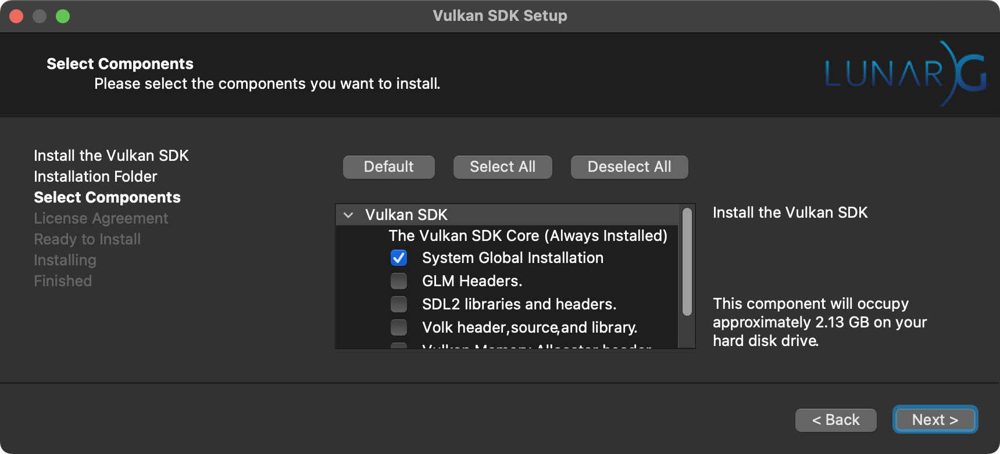
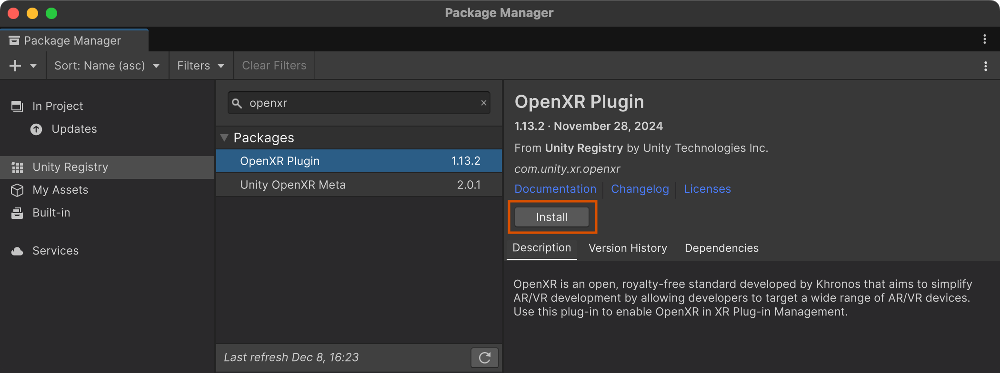
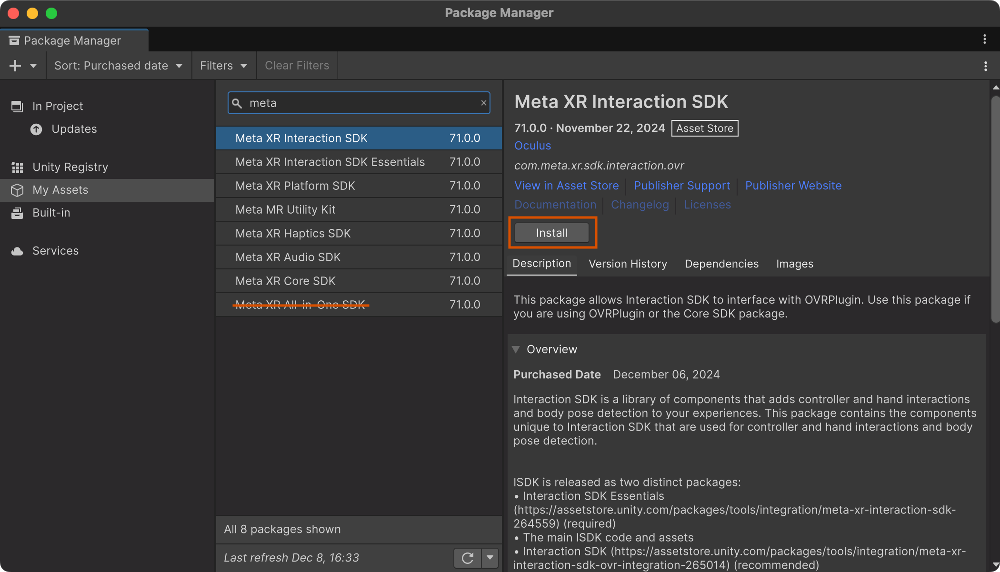
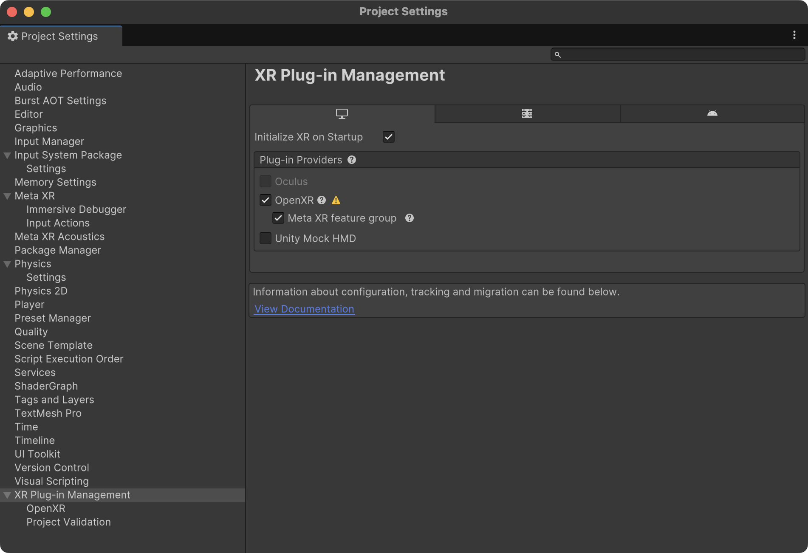
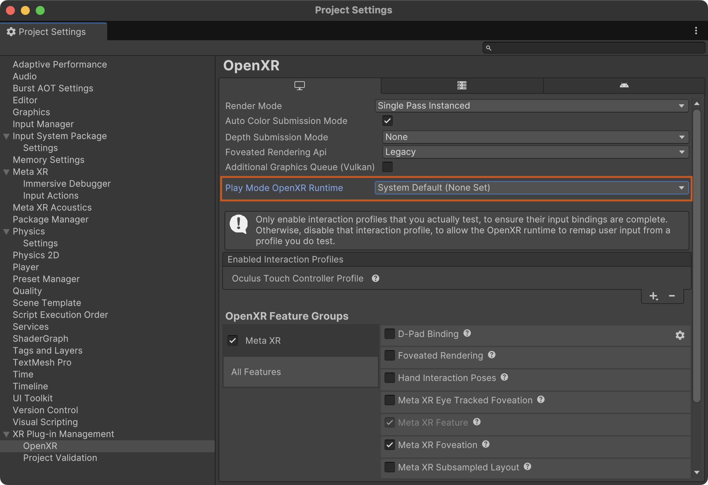

If you're looking to develop [Unity](https://unity.com/) projects for [Meta Quest](https://www.meta.com/quest/) devices
using macOS with an M-series chip, it recently got a little easier.  This is a step-by-step guide to setting up a fresh
environment with Unity, the [Meta XR Simulator](https://developers.meta.com/horizon/documentation/unity/xrsim-intro/),
your Meta Quest device, and an Xbox Wireless Controller on Apple Silicon.  Before we begin, it's important to note that
Meta's [Unity Link](https://developers.meta.com/horizon/documentation/unity/unity-link) tool is still not supported on
macOS.

We'll first install the Meta XR Simulator and its dependencies, then configure it in a new Unity 6 project, and map an
Xbox controller to its input.  Then we'll hook Unity up to our Meta Quest device as a build and run target, and map its
controls to the simulator as well.

[Install Homebrew](https://brew.sh/) if you don't already have it.

### Meta XR Simulator Setup
The simulator relies on the [Vulkan SDK](https://www.lunarg.com/vulkan-sdk/).  Download it 
[from here](https://vulkan.lunarg.com/doc/sdk/latest/mac/getting_started.html).  Unzip it and run the installer app
`InstallVulkan.app`. **<span style="color:orange">The options you select during installation are important!</span>**

Press **Next** on the welcome screen of the installer.  Press **Next** again to use the default installation location
(or select a custom one if you'd like).  On the Components screen, make sure that **System Global Installation** is
selected:



Press **Next** and continue the rest of the installation as normal.

Once that's complete, install the simulator itself in terminal:

```shell
brew tap Oculus-VR/tap
brew install meta-xr-simulator
```

Now we need to run the post installation script.  First find the version of the simulator you just installed:

```shell
ls -la /opt/homebrew/Cellar/meta-xr-simulator/
```

Then use it by replacing `__VERSION__` when running the script:

```shell
sudo /opt/homebrew/Cellar/meta-xr-simulator/__VERSION__/post_installation_macos.sh
```

At this point, the simulator should be fully installed and configured.

### Unity Setup

Grab the Unity Hub if you don't already have it:

```shell
brew update
brew install --cask unity-hub
```

Open Unity Hub and go to **Installs** and then **Install Editor**.  Select **Install** next to the latest version at or
above `6000.0.30f1`:


Be sure to include the **Android Build Support**,
**<span style="color:orange">this is also important!</span>**


When that installation is complete, go back to **Projects** in Unity Hub, and make a new 3D project.  Meta recommends 
using the **Built-In Render Pipeline**, though I've got mine working with the **Universal Render Pipeline**.

Choose your location, name, and Unity services as desired and click **Create project**.

### Project Setup

With your Unity project open, go to **Window** → **Package Manager** → **Unity Registry** and search for `OpenXR Plugin`
and install it:



Close any windows that pop up, we'll come back to them. Next we need to add some assets.  Because our simulator must be
installed with Homebrew, <span style="color: orange">we cannot use the 
[<span style="color: orange">Meta XR All-in-One SDK</span>](
  https://assetstore.unity.com/packages/tools/integration/meta-xr-all-in-one-sdk-269657
)!</span>

Instead, we will install the individual SDKs that we need:

* [Meta XR Core SDK](https://assetstore.unity.com/packages/tools/integration/meta-xr-core-sdk-269169)
* [Meta XR Audio SDK](https://assetstore.unity.com/packages/tools/integration/meta-xr-audio-sdk-264557)
* [Meta XR Haptics SDK](https://assetstore.unity.com/packages/tools/integration/meta-xr-haptics-sdk-272446)
* [Meta MR Utility Kit](https://assetstore.unity.com/packages/tools/integration/meta-mr-utility-kit-272450)
* [Meta XR Platform SDK](https://assetstore.unity.com/packages/p/meta-xr-platform-sdk-262366)
* [Meta XR Interaction SDK](https://assetstore.unity.com/packages/tools/integration/meta-xr-interaction-sdk-265014)
* [Meta XR Interaction SDK Essentials](
  https://assetstore.unity.com/packages/tools/integration/meta-xr-interaction-sdk-essentials-264559
)

Add each to your assets in the Unity Asset Store using the links above, and **Install** each of them in the **Package
Manager** in Unity:



The latest available version should be at or above `71.0.0` and no longer requires experimental packages.  It will
prompt you to **Enable Meta XR Feature Set**, so select **Enable** and then **Restart Editor**.  When it's restarted,
finish installing the SDKs from the **Package Manager**.

When you get to the **Meta XR Interaction SDK**, it will prompt you to choose a hand skeleton SDK:


Follow the advice and choose **Use OpenXR Hand**.  That installation can be your last as it also installs **Meta XR
Interaction SDK Essentials**.  Close the **Package Manager**.

Almost there!  Let's go to **Edit** → **Project Settings...** → **XR Plug-in Management** and enable **OpenXR** on each
platform tab:



Then go down to **Project Validation** and click **Fix All** on each platform tab:


And finally we go up one item on the left menu to **OpenXR** and set the **Play Mode OpenXR Runtime** to **Other**:



A file selector will pop up.  Use `command+shift+G` and paste in your simulator path from earlier, remembering to
replace `__VERSION__`:

```shell
/opt/homebrew/Cellar/meta-xr-simulator/__VERSION__/
```

Hit `return` to navigate to that folder, and select the `meta_openxr_simulator.json` file and hit **Open**.

That's it!  Run your project with the normal Unity **Play** button and it should now launch in the simulator:

<video controls>
  <source src="first-run.mov" type="video/mp4">
</video>

### Xbox Controller Setup


<span style="color:red">come back to this</span>
https://developers.meta.com/horizon/downloads/package/oculus-developer-hub-mac
